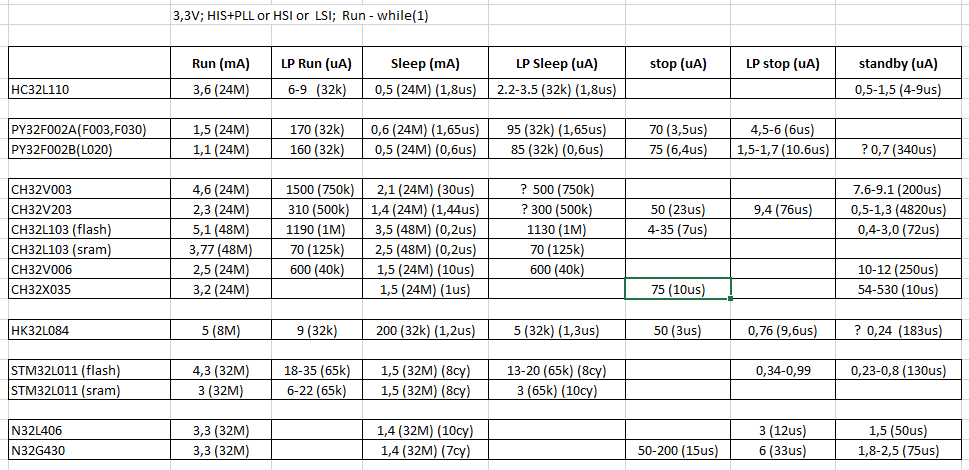

# MCU 32bit less then 20 pins
Небольшой обзор 32bit MCU с малым количеством выводов ( < 20 pins )
Альтернативы STM32 и сравнение

```
ST        - STM32   /  ARM     ( Cortex-M0+ )
PUYA      - PY32    /  ARM     ( Cortex-M0+ )
Hangshun  - HK32    /  ARM     ( Cortex-M0+ )
Xiaohua   - HC32    /  ARM     ( Cortex-M0+ )
WCH       - CH32    /  RISC-V  ( RV32EC )
```

// только упоминаются корпуса  < 20 выводов

### STM32  

- очень маленький выбор конторллеров, вот почти все 
```
  STM32C011   - 48MHz; Flash 16K/32K; RAM 6K; so8  (2.0-3.6V)
  STM32G03x   - 64MHz; Flash 32K/64K; RAM 8K; so8  (2.0-3.6V)
  STM32L011   - 32MHz; Flash  8K/16K; RAM 2K; EEPROM 0.5K; tssop14  (1.8-3.6V)
```
только so8 и tssop14  ( в этих сериях также есть tssop20 и пр. )<br> 
Все остальные серии начинаются с корпусов tssop20 или больше

### PY32F0xxx

- количество серий контроллеров немного
- поражает количество возможных корпусов и разной разводки
- напряжение питания до 5V

##### PY32F002A; PY32F003; PY32F030 

  по идее это одинаковый контроллер (чип один и тот же)<br>
  только разные корпуса, порты, разводка и прочее<br>
```
24-48MHz; Flash 16-64K; RAM 2-8K; (1.7-5.5V)
  PY32F002A  max 24MHz; Flash 20K; RAM 3K; noDMA?; noPLL?; HSI only? 24M
  PY32F003   max 32MHz; Flash 16-32K; RAM 2-4K; DMA; noPLL?
  PY32F030   max 48MHz; Flash 32-64K; RAM 4-8K; DMA; PLL x2 (? x3)
  (standby 4,5uA)
  HSI (4M, 8M, 16M, 22.12M, 24M) и есть калибровочные константы для каждой частоты!
  LSI 32768Hz
```
Корпуса:<br> 
sop8  sop16  qfn16  essop10  msop10  dfn8(3x2)  dfn8(1.5x1.5)  

Программатор:<br>
ST-Link-2, j-Link OD, WCH-LinkE (DAP), SLogic combo 8 (DAP)  - проверено в Keil<br>
WCH-LinkE (DAP) - проверено с openOCD (PUYA ed)

Более подробно [ЗДЕСЬ](https://github.com/Xiamatsu/py32f002a_003_030)

##### PY32F002B; PY32L020

  похоже что тоже одинаковый кристалл в этих двух сериях
```
24-48MHz; Flash 24K; RAM 3K; (1.7-5.5V)
  PY32F002B  max 24MHz; Flash 24K; RAM 3K; noDMA; noBootloader; noPLL?

  HSI - 24MHz  LSI - 32,768KHz
  LSE - (только в корпусах so-14, so-16)
  HSE_ClkIn - 4-32MHz 
  (standby 1,5uA)
  (deepsleep 0,7uA)
```
Корпуса 
sop8  sop14  sop16  qfn16  

Более подробно [ЗДЕСЬ](https://github.com/Xiamatsu/py32f002b)

### HK32F030xx

- много разных серий контроллеров с неудачной маркировкой 
- есть серии для определённой замены старых 8-16 бит контроллеров 
- разводка выводов как у stm8 stm32
- есть версии до 5V ( только бывает неудачная маркировка - в конце буква )

```
HK32F030M - 32MHz; Flash  16K/32K; RAM 2K/4K; EEPROM 0.4K; so8; tssop16  (1.8-3.6V)
            USART,I2C,SPI/I2S,ADC12,IOMUX(so8),IWDG+WWDG,GPTim-1,AdwTim-1,BasTim-1,AWU
            HSI - 32MHz, LSI - 114kHz
            EXTclk up to 32MHz
```            

HK32F0301M - тоже самое, только 48MHz<br>
HK32F0301MxxxC - (2.4-5.5V) 


### HC32L

Есть только одна серия которая имеет tssop16,csp16 
```
HC32L110 - 32MHz, Flash 16K/32K; RAM 2K/4K; csp16,tssop16 (1.8-5.5V)
  RTC,UART-2,LPUART,SPI,I2C, GPTim-3, PCATim-1, AdvTim-3, WDT, Buzz
  ADC12-6ch, COMP-2, LVD, noDMA, noPLL
  HSI - (4/8/16/22.12/24MHz) LSI - (32.8/38.4kHz)
  HSE, LSE - даже в этих корпусах и разные подключения и может быть одновременно
  частота до 32МHz только от внешнего кварца, так как нет PLL
  (standby 0,6uA)

  Есть документация на английском языке.
  Регистры переферии собственная нотация.
  Таймеры 0,1,2 могут быть 32 бит в режиме простого счёта.

  '+' Потребление в режимах LP-Run и LP-Stop - очень низкое (см. ниже таблицу)
```

### CH32V 

Интересные новые ядра RISC-V

```
CH32V003 - 48MHz, Flash 16K, RAM 2K;  so8,so16  (2.7-5.5V)
  '+' программирование и отладка по 1 проводу
  '+' ISA ( RV32EC ) простая и мощная на уровне Cortex-M3
  '-' нет умножения в ISA 
  '-' в корпусах so8 и so16 нет SPI
  '-' ADC 10-bit
  '-' потребление не маленькое в режимах Stop и Standby
  HSI-24M LSI-128K, есть подключения для кварца HSE(4M-24M) даже в so8
  (standby 9uA)
```
- ожидаются!
```
CH32V002 - по сравнению с v003
  '+' добавлен RAM до 4К
  '+' ISA ( RV32EmC ) добавлено умножение
  '+' ADC 12-bit
  '+' расширен portmapping ( SPI вернули в so16 )
  '+' расширен диапазон питания (2-5.5V)
  '+' добавлен корпус qfn12 (2x2 pitch 0.4)
  '-' убрали OPA/CMP
```

### Небольшое исследование DS по вопросу потребления


